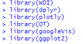

# DataVisualization
## Visualization sets of Gross Domestic Product per capita, Population and Life expectancy in G20 and European Union countries
### Structured abstract
Population, human life expectancy, and global Gross Domestic Product (GDP) have been rising steadily in human history (Riley, 2001; Lepenies, 2016). The study notes the link between these data. In particular, it could focus on about 40 years of data from G20 countries and EU countries, which account for more than 70 percent of the world’s population, 90 percent of global GDP and more than 80 percent of trade (Teker & Yuksel, 2016). In this study, the trend of each country's GDP per capita is identified by a time series graph and life expectancy data is visualized as a Choropleth Map. It also visualizes and analyses the data with a Scatter plot to identify each association of data. As an example of the identified links, some argue that an increase in personal income (increasing medical expenses) has resulted in an increase in life expectancy (Howard & Odum, 2015), but in many countries in G20 and European Union (EU), an increase in life expectancy has occurred earlier than an increase in personal income. Therefore, it may be appropriate to determine that the increased working hours (increasing life expectancy) have resulted in an increase in personal income (GDP per capita).

### Part 1 Introduction and aims
The current infant mortality rate is significantly lower than in the past, and current medical technology is able to treat many diseases. Then, humans can enjoy old age more than ever (Mackey & Bassendowski, 2017; Case & Deaton, 2015). Human life expectancy has increased, and more humans could exist on Earth (Riley, 2001). Thus, more human Gross Domestic Product (GDP) activities are bound to increase than ever before. As evidenced by this, over the last 200 years, the GDP of many countries has exploded. GDP is not just a numerical representation of a country's economic output, the value of all goods and services, but the strongest statistic in history. Because the rate of change in GDP serves as a key indicator of growth and development, the global economy and global politics are largely defined by GDP (Lepenies, 2016). In other words, The GDP data is likely to contain a variety of information. Also, GPD, population and life expectancy, all of which have grown steadily before (Riley, 2001), may inevitably relate to each other In order to focus and understand their relationships, we need visualization data on the relationship of these data. It could focus on World Bank data from G20 countries and EU countries, which account for more than 65 percent of the world’s population, 85 percent of global GDP (Teker & Yuksel, 2016).
The justification for this study is to present through data visualization the relationship of the three data that seems unrelated but has a close relationship. In addition, the study could help emphasize the importance of extending human life expectancy in order to achieve the development of the global economy and politics.
Clear visualization of these GDP, population and life expectancy data would give a broad understanding of each country's politics and economy (Lepenies, 2016). The purpose of this study is to communicate as much information as possible through data visualization as possible, so that it is as simple as possible, and anyone can recognize it. Furthermore, this study uses R Studio Version 1.2.5001 and packages WDI, dplyr, plotly, DT, googleVis and ggplot2 to integrate command formats and syntax.
A)	Research question:
1)	Can the study find a link between the three by visualizing the data of GDP per capita, population and life expectancy?
B)	Objectives: The visualization process allows us to find a link between the data.
1)	To identify the trend by year of GDP per capita
2)	To identify the life expectancy of each country through a map produced
3)	To identify the life expectancy by year through a Scatter plot and Interactive graph
4)	To identify the life expectancy by GDP per capita through a Scatter plot and Interactive graph
5)	To identify the population by GDP per capita through a Scatter plot and Interactive graph

The study has four benefits: First, the data visualization found in the study could easily help many people understand the economies and societies of major countries (G20 and EU) around the world. Second, as the study emphasizes the importance of data visualization, this study could have a positive impact on data visualization and understanding global economic trends. Third, it could be referenced to studies using other data as well as GDP per capita, population and life expectancy. Finally, those who are new to R could easily copy and understand World Bank data. An overview of the subsection studies is as follows. The first part is about introduction. The explaining the methodology in Part 2. Part 3 describes the results and discussion. The conclusion in Part 4. The last part is about the appendices and reference list.

### Part 2 Methodology
As we looked at above, GDP, population and life expectancy data might be correlated, and this data alone may be able to understand much about the economies and societies of G20 and EU countries (Howard & Odum, 2015; Teker & Yuksel, 2016). Therefore, the purpose of this study is to study the associations of each other by making the above three data simple and easy visualizations that are recognizable to all.
The study would also answer the following questions.
•	Can the study find a link between the three by visualizing the data of GDP per capita, population and life expectancy?

Research Design
The proper philosophy of this research is Pragmatism. It can be said that this philosophy focuses on the use of realistic tools and places importance on practical effects (Saunders, Lewis & Thornhill, 2009). As for quantitative methods, statistics and data of G20 and EU countries are collected statistics from World Bank Data Catalog. Also, this study could visualize these collected statistics and data to find their associations. This study would be a longitudinal inductive method because it establishes hypotheses, analyses visualized data and leads to general principles.

Console 1-1

The Console 1-1 reveals the packages to use. Using a package (WDI) is easier and faster than downloading directly from the World Bank data catalog website. It is also easier to find the data you want. Such active use of multiple packages could effectively reach your desired research goals.

You could search for data using keywords in WDIsearch. For instance, if you are looking for data on GDP per capita, you may enter it as above. Therefore, in the above way, we could find that the data required for this study is ("NY.GDP.PCAP.CD", # GDP per capita "SP.DYN.LE00.IN", # life expectancy "SP.POP.TOTL" #population).

